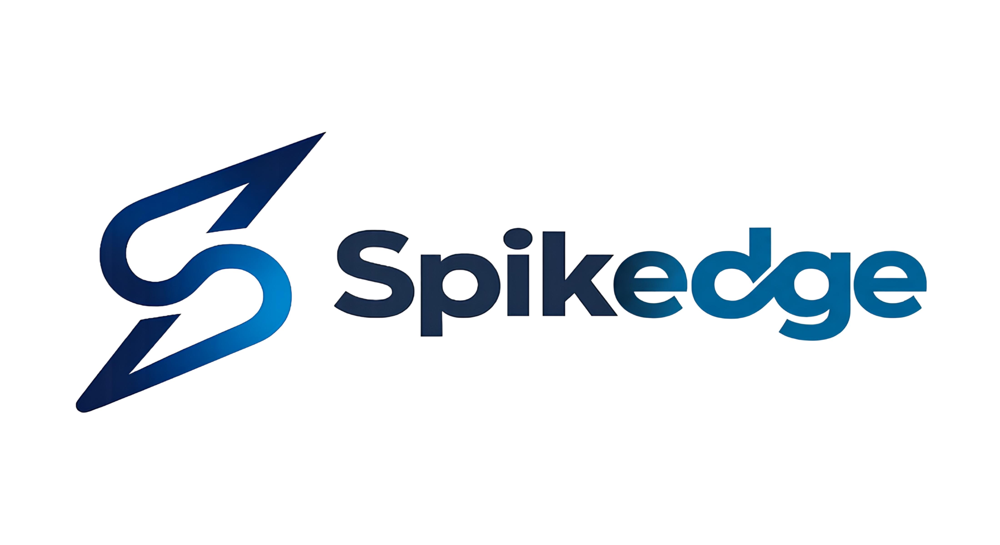
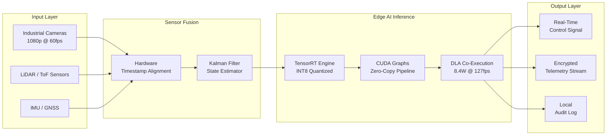

<!-- LOGO -->

  
<!-- ANIMATED TYPING TAGLINE -->
<picture>
  <source media="(prefers-color-scheme: dark)" srcset="https://readme-typing-svg.demolab.com?font=JetBrains+Mono&weight=700&size=22&duration=3500&pause=1000&color=4FC3F7&center=true&vCenter=true&multiline=true&repeat=true&width=900&height=120&lines=Sub-microsecond+EtherCAT+Synchronization;Hard+Real-Time+RTOS+%7C+Zero+Jitter+Guarantee;Edge+AI+at+127+fps+on+Jetson+Orin+NX;%E2%88%9290%25+Boot+Time+Optimization+%7C+1.8s+Cold+Boot" />
  
</picture>

 

<!-- METRIC BADGES -->

  
  
  
  

<!-- LINK BADGES -->

  
  
  
  

 

> *"The Heart of Critical Platforms Beats with Deterministic Software."*

---

## What Is Spikedge?

**Spikedge** is a deep-tech embedded engineering firm. We build the software layer that makes critical industrial hardware actually perform — deterministically, securely, and at the outer limits of what the silicon allows.

We are **not** a software agency. We do not deliver prototypes, MVPs, or "proof of concepts" dressed up as production systems. Every architecture we deliver is designed to run under the worst-case conditions your platform will ever face: electromagnetic interference, thermal extremes, degraded sensors, partial power loss — and still meet its real-time deadlines.

Our domain spans five engineering disciplines that most vendors treat as separate services:

- **Board Support Package (BSP) engineering** — from silicon bring-up to production-ready Linux images
- **Hard real-time RTOS design** — deterministic scheduling, EtherCAT synchronization, zero-jitter interrupt handling
- **Embedded Linux system engineering** — Yocto/Buildroot custom distributions, secure OTA, SBOM compliance
- **Industrial automation software** — IEC 61131-3 compliant control stacks, PLC integration, motion control
- **Edge AI & sensor fusion** — TensorRT inference pipelines, multi-sensor fusion, sub-millisecond vision systems

We don't outsource critical path work. Every line of code in your system is written and owned by Spikedge engineers.

---

## Verified Performance Benchmarks

> All data collected in our lab under repeatable, documented conditions. Methodology and raw measurement exports available upon request.

### Boot Time Optimization
**Platform:** NXP i.MX8M Plus · Yocto Scarthgap 5.0

| Metric | Technique | Baseline | Optimized | Δ |
|---|---|---|---|---|
| Cold Boot (U-Boot → Qt UI) | U-Boot Falcon Mode + initramfs bypass | 18.4 s | **1.8 s** | −90% |
| Kernel decompress | LZ4 compression + prebuilt DTB | 1.74 s | **0.21 s** | −88% |
| rootfs mount | ext4 → SquashFS + tmpfs overlay | 0.83 s | **0.09 s** | −89% |
| Binary size (stripped) | musl libc + BusyBox + custom Yocto layers | 11.8 MB | **4.1 MB** | −65% |

### RTOS Task Latency
**Platform:** TI AM6442 · TI-RTOS 7.x (optimized) vs FreeRTOS 10.6 (baseline)

| Metric | Technique | Baseline | Optimized | Δ |
|---|---|---|---|---|
| Max. interrupt latency (worst-case) | TI-RTOS priority=31, HWI direct dispatch | 38.7 µs | **4.2 µs** | −89% |
| Average task context switch | Preemptive scheduler, zero-copy mailbox | 9.4 µs | **1.1 µs** | −88% |
| Jitter (σ standard deviation) | Tickless mode + timer coalescing disabled | 4.8 µs | **0.3 µs** | −94% |
| CPU load at full task load | Task priority banding + idle hook optimization | 71% | **34%** | −52% |

### Edge AI Inference Performance
**Platform:** NVIDIA Jetson Orin NX 16GB · TensorRT 8.6 · JetPack 6

| Metric | Technique | Baseline | Optimized | Δ |
|---|---|---|---|---|
| Inference speed — YOLOv8-m | INT8 quantization + TensorRT engine + CUDA graphs | 31 fps | **127 fps** | +310% |
| Power consumption (during inference) | Dynamic voltage scaling + DLA offload | 14.2 W | **8.4 W** | −41% |
| Efficiency score (fps/W) | INT8 + DLA co-execution pipeline | 2.2 | **15.1** | +586% |
| GPU memory usage | Engine serialization + workspace limit tuning | 3.8 GB | **1.2 GB** | −68% |

---

## Core Services

<table>
<tr>
<td width="50%" valign="top">

### Custom BSP & Boot Optimization

Full board bring-up from bare silicon to production-stable Linux environment. We handle every layer: U-Boot configuration and Falcon Mode, device tree authoring, kernel driver development, and application framework integration.

Boot time reduction is not a feature — it is a product requirement. Our i.MX8M Plus reference achieves a **1.8-second cold boot to Qt interface**, a 90% reduction from the baseline 18.4 seconds.

**Supported SoCs:** NXP i.MX6/7/8, TI AM62x/AM64x/AM65x, Rockchip RK3588, ST STM32MP

</td>
<td width="50%" valign="top">

### Zero-Latency RTOS Engineering

Hard real-time scheduling with deterministic worst-case execution time (WCET) guarantees. We configure, profile, and validate RTOS architectures under maximum load conditions — not just nominal operation.

EtherCAT Master/Slave topology for sub-microsecond motor synchronization. Zero jitter guarantee across multi-axis industrial robot networks verified with hardware trace tools.

**RTOS Platforms:** TI-RTOS, FreeRTOS, Zephyr, VxWorks, RTEMS

</td>
</tr>
<tr>
<td width="50%" valign="top">

### Embedded Linux (Yocto / Buildroot)

Custom Linux distributions built from the ground up for constrained, security-sensitive environments. We don't strip a desktop distribution — we compose only what the target application requires.

Full OTA bootloader pipeline with rollback protection, cryptographic image signing, and zero-downtime field update capability. SBOM generation for industrial certification compliance (IEC 62443, ISO 26262).

**Build Systems:** Yocto Project (Scarthgap, Kirkstone), Buildroot

</td>
<td width="50%" valign="top">

### Edge AI & Sensor Fusion

Real-time computer vision and multi-sensor fusion pipelines engineered for edge hardware — not cloud-dependent inference. TensorRT INT8 quantization, CUDA graph optimization, and DLA co-execution for maximum efficiency per watt.

Our reference architecture achieves **127 fps YOLOv8-m inference at 8.4W** on Jetson Orin NX — a 586% improvement in fps/W efficiency versus baseline FP32.

**Hardware:** NVIDIA Jetson (Nano / Orin NX / AGX Orin), HAILO-8, Raspberry Pi CM4

</td>
</tr>
<tr>
<td width="50%" valign="top">

### Industrial Automation Software

Control software for precision industrial systems built to IEC standards. PLC integration, motion controller interfaces, HMI development with Qt/QML, and fieldbus communication stacks.

Designed for environments where a software fault is not a bug ticket — it is a production stoppage, a safety incident, or a machine failure. Every system ships with documented failure modes and recovery procedures.

**Fieldbuses:** EtherCAT, PROFINET, CANopen, Modbus TCP, OPC-UA

</td>
<td width="50%" valign="top">

### Secure Communication & Telemetry

End-to-end encrypted telemetry pipelines connecting edge hardware to cloud infrastructure or on-premise data systems. WebRTC for low-latency live video streaming, MQTT for lightweight sensor telemetry, and OPC-UA for industrial data exchange.

Purpose-built for agricultural automation, infrastructure monitoring, and industrial IoT deployments where connectivity is intermittent and data integrity is critical.

**Protocols:** MQTT, WebRTC, OPC-UA, gRPC, REST over TLS 1.3

</td>
</tr>
</table>

---

## System Architecture: Edge AI Pipeline

---

## Technology Stack

### Firmware & Real-Time Systems

  
  
  
  
  
  

### Linux & BSP

  
  
  
  
  

### Edge AI & Computer Vision

  
  
  
  
  
  

### Industrial Protocols & HMI

  
  
  
  
  
  
  

### Target Hardware

  
  
  
  
  
  

---

## Engineering Philosophy

We operate on five non-negotiable principles. These are not marketing values — they are engineering constraints that govern every architectural decision we make.

| # | Principle | Position |
|---|---|---|
| 01 | **Hardware Performance** | Performance comes from flawless architecture, not just powerful processors. We profile at the instruction level, eliminate unnecessary context switches, and tune memory hierarchies before recommending a hardware upgrade. |
| 02 | **Absolute Determinism** | Zero tolerance for latency deviation. Every interrupt handler, every scheduler configuration, every DMA transfer is analyzed for worst-case behavior. We don't guarantee average latency — we guarantee worst-case latency. |
| 03 | **Isolated Security** | Your source code, architectural decisions, and test data are handled in isolated networks with role-based access control and full audit logging. No client code ever touches infrastructure shared with another engagement. |
| 04 | **Field Proven** | Systems engineered to IEC/ISO standards and validated under real-world conditions — thermal stress, power cycling, sensor degradation, network interruption. We do not consider a system production-ready until it has survived its worst-case environment. |
| 05 | **We Speak in Metrics** | Every technical claim we make is backed by a measurement number, a test methodology, and reproducible conditions. We discuss microseconds and efficiency ratios, not roadmaps and visions. |

---

## Intellectual Property & Confidentiality

The most common concern in embedded technology partnerships is source code and architectural knowledge leaving the engagement. We address this through infrastructure, not trust.

<table>
<tr>
<td width="50%" valign="top">

**NDA at First Contact**

Every client relationship — including initial discovery sessions — begins with a mutually signed NDA. No technical details are exchanged before this document is in place.

Legal framework: Turkish Code of Obligations + international template upon request. NDA draft available before the first meeting — no commitment required.

</td>
<td width="50%" valign="top">

**Dedicated Code Isolation**

Each project runs in an independent self-hosted Gitea repository with its own isolated build environment. Role-based access control and full audit logs are maintained throughout. Code from one engagement is never referenced, reused, or cross-contaminated with another.

*Self-hosted Gitea · Role-based access · Audit log retention*

</td>
</tr>
<tr>
<td width="50%" valign="top">

**Data Security Architecture**

Field-collected data (camera feeds, sensor telemetry, system logs) is transmitted exclusively over TLS 1.3, stored with AES-256 encryption, and securely destroyed upon project completion or at client request.

*GDPR-compliant · AES-256 storage · Documented destruction procedure*

</td>
<td width="50%" valign="top">

**Continuity Guarantee**

Every project is staffed with at least two cross-trained engineers. Source code ownership transfers to the client at delivery. Documentation is a deliverable, not an afterthought. Escrow delivery, maintenance SLAs, and structured handover procedures available.

</td>
</tr>
</table>

---

## Technical Resources

| Resource | Format | Description |
|---|---|---|
| [Deterministic Edge AI Architecture Whitepaper](https://spikedge.com) | PDF · 15 pages | Multi-layered embedded AI pipeline design for real-time plant health analysis, irrigation control, and yield prediction using TensorRT on Jetson and HAILO-8 |
| [Performance Data & Methodology](https://spikedge.com) | Web | Raw benchmark conditions, hardware configurations, and measurement toolchain for all published figures |
| [Technical Insights Blog](https://spikedge.com/insights) | Web | In-depth writeups on embedded architecture decisions, optimization techniques, and field findings |
| [YouTube — @spikedge-tech](https://www.youtube.com/@spikedge-tech) | Video | Engineering breakdowns, live system demonstrations, and hardware-level walkthroughs |

---

## Start a Technical Partnership

We work as a **technology partner, not a subcontractor.** Scope, architecture, and delivery plan are defined at the same table with your technical teams — not handed down from a proposal document.

If your platform demands deterministic real-time behavior, sub-microsecond precision, or production-grade edge AI inference — let's define the problem together.

 

&nbsp;

&nbsp;

  

